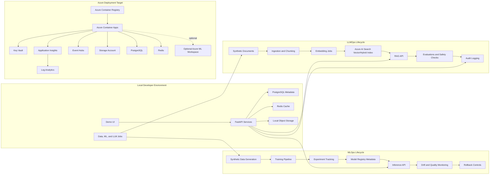

# careai-platform

`careai-platform` is a local-first, Azure-deployable monorepo for demonstrating an enterprise MLOps and LLMOps platform for healthcare-style workflows. It uses synthetic healthcare-like data only and is designed for interview demos, architecture walkthroughs, and reproducible engineering discussions.

The platform is intended to show the full lifecycle of model and RAG systems: synthetic data generation, model training, experiment tracking, model registry metadata, promotion, deployment, inference, monitoring, rollback, document ingestion, chunking, embeddings, Azure AI Search retrieval, prompt management, evaluations, safety checks, audit trails, and governance controls.

## Architecture



## Local Setup

Prerequisites:

- Python 3.11+
- Node.js LTS
- Docker Desktop or compatible container runtime
- Make
- Azure CLI for cloud deployment work
- Terraform for infrastructure work

Install dependencies:

```bash
make setup
cp .env.example .env
```

Start local platform dependencies:

```bash
make local-up
```

Run the API services:

```bash
.venv/bin/uvicorn careai_control_plane_api.main:app --reload --port 8000
.venv/bin/uvicorn careai_inference_service.main:app --reload --port 8001
.venv/bin/uvicorn careai_rag_service.main:app --reload --port 8002
```

Run the frontend:

```bash
npm --prefix apps/web-console run dev
```

Validate the scaffold:

```bash
make test
make lint
make docker-build
```

Stop local dependencies:

```bash
make local-down
```

Configuration should be documented in `.env.example`. Do not commit real `.env` files, secrets, credentials, tokens, or connection strings.

Local endpoints:

- Web console: `http://localhost:3000`
- Control plane API: `http://localhost:8000/healthz`
- Control plane API docs: `http://localhost:8000/docs`
- Inference service: `http://localhost:8001/healthz`
- RAG service: `http://localhost:8002/healthz`
- MLflow: `http://localhost:5000`

## Control Plane Examples

Create a synthetic dataset asset:

```bash
curl -s -X POST http://localhost:8000/datasets \
  -H 'content-type: application/json' \
  -H 'x-actor: data-steward' \
  -H 'x-correlation-id: demo-dataset-001' \
  -d '{
    "name": "synthetic-claims",
    "version": "2026.06",
    "owner": "platform-demo",
    "schema_uri": "azurite://schemas/claims.json",
    "storage_uri": "azurite://datasets/synthetic-claims",
    "pii_classification": "synthetic-no-phi"
  }'
```

Create a model artifact using the returned dataset `id`:

```bash
curl -s -X POST http://localhost:8000/models \
  -H 'content-type: application/json' \
  -H 'x-actor: ml-engineer' \
  -H 'x-correlation-id: demo-model-001' \
  -d '{
    "name": "claims-risk",
    "version": "0.1.0",
    "framework": "scikit-learn",
    "artifact_uri": "azurite://models/claims-risk/0.1.0",
    "training_dataset_id": "<dataset-id>",
    "metrics_json": {"auc": 0.91, "f1": 0.84},
    "lineage_json": {"run_id": "demo-run-001", "seed": 20260614},
    "stage": "dev"
  }'
```

Promote the model after synthetic evaluation and review:

```bash
curl -s -X POST http://localhost:8000/models/<model-id>/promote \
  -H 'content-type: application/json' \
  -H 'x-correlation-id: demo-promote-001' \
  -d '{
    "stage": "approved",
    "actor": "model-risk-reviewer",
    "notes": "Synthetic evaluation passed and approval is recorded."
  }'
```

## Claims-Risk Training Pipeline

Generate synthetic claims data:

```bash
python -m train_claims_risk.generate_data \
  --output data/synthetic_claims.csv \
  --rows 5000
```

Train the model, log to MLflow, and write model metadata:

```bash
python -m train_claims_risk.train \
  --data data/synthetic_claims.csv
```

Register the candidate model with the control plane when the API is running:

```bash
python -m train_claims_risk.train \
  --data data/synthetic_claims.csv \
  --register-control-plane-url http://localhost:8000
```

See [pipelines/train-claims-risk/README.md](pipelines/train-claims-risk/README.md) for the full MLOps walkthrough.

## Safety and Governance

- Synthetic healthcare-like data only.
- No real patient data, PHI, PII, credentials, or proprietary branding.
- Structured JSON logs with sensitive-looking values redacted.
- RBAC placeholders, audit trails, lineage, reproducibility metadata, safety checks, data-quality checks, drift monitoring, and human-in-the-loop flags are first-class demo concerns.

## Roadmap

- [x] Monorepo scaffold with Makefile, service layout, shared schemas, and Docker Compose.
- [x] Synthetic healthcare-like data generator with deterministic seeds and quality checks.
- [x] MLOps training pipeline with experiment metadata and model registry records.
- [ ] Inference service with model promotion, deployment metadata, monitoring, and rollback path.
- [ ] LLMOps document ingestion, chunking, embeddings, and Azure AI Search-compatible indexing.
- [ ] RAG API with prompt registry, evaluations, safety checks, and audit logging.
- [x] Simple TypeScript demo UI skeleton for platform workflows and governance views.
- [ ] Terraform implementation under `infra/terraform` for Azure Container Apps, ACR, Key Vault, Storage, PostgreSQL, Redis, Event Hubs, Log Analytics, Application Insights, and Azure AI Search.
- [x] GitHub Actions CI placeholder under `.github/workflows`.
- [ ] Optional Azure ML workspace integration.
- [ ] Optional AKS and Helm deployment extension.
