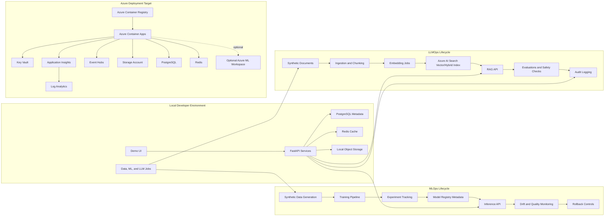

# careai-platform

`careai-platform` is a local-first, Azure-deployable monorepo for demonstrating an enterprise MLOps and LLMOps platform for healthcare-style workflows. It uses synthetic healthcare-like data only and is designed for interview demos, architecture walkthroughs, and reproducible engineering discussions.

The platform is intended to show the full lifecycle of model and RAG systems: synthetic data generation, model training, experiment tracking, model registry metadata, promotion, deployment, inference, monitoring, rollback, document ingestion, chunking, embeddings, Azure AI Search retrieval, prompt management, evaluations, safety checks, audit trails, and governance controls.

## Architecture



## Local Setup

Prerequisites:

- Python 3.11+
- Node.js LTS
- Docker Desktop or compatible container runtime
- Make
- Azure CLI for cloud deployment work
- Terraform for infrastructure work

Install dependencies:

```bash
make setup
cp .env.example .env
```

Start local platform dependencies:

```bash
make local-up
```

Run the API services:

```bash
.venv/bin/uvicorn careai_control_plane_api.main:app --reload --port 8000
.venv/bin/uvicorn careai_inference_service.main:app --reload --port 8001
.venv/bin/uvicorn careai_rag_service.main:app --reload --port 8002
```

Run the frontend:

```bash
npm --prefix apps/web-console run dev
```

Validate the scaffold:

```bash
make test
make lint
make docker-build
```

Stop local dependencies:

```bash
make local-down
```

Configuration should be documented in `.env.example`. Do not commit real `.env` files, secrets, credentials, tokens, or connection strings.

Local endpoints:

- Web console: `http://localhost:3000`
- Control plane API: `http://localhost:8000/healthz`
- Control plane API docs: `http://localhost:8000/docs`
- Inference service: `http://localhost:8001/healthz`
- RAG service: `http://localhost:8002/healthz`
- MLflow: `http://localhost:5000`

## Control Plane Examples

Create a synthetic dataset asset:

```bash
curl -s -X POST http://localhost:8000/datasets \
  -H 'content-type: application/json' \
  -H 'x-actor: data-steward' \
  -H 'x-correlation-id: demo-dataset-001' \
  -d '{
    "name": "synthetic-claims",
    "version": "2026.06",
    "owner": "platform-demo",
    "schema_uri": "azurite://schemas/claims.json",
    "storage_uri": "azurite://datasets/synthetic-claims",
    "pii_classification": "synthetic-no-phi"
  }'
```

Create a model artifact using the returned dataset `id`:

```bash
curl -s -X POST http://localhost:8000/models \
  -H 'content-type: application/json' \
  -H 'x-actor: ml-engineer' \
  -H 'x-correlation-id: demo-model-001' \
  -d '{
    "name": "claims-risk",
    "version": "0.1.0",
    "framework": "scikit-learn",
    "artifact_uri": "azurite://models/claims-risk/0.1.0",
    "training_dataset_id": "<dataset-id>",
    "metrics_json": {"auc": 0.91, "f1": 0.84},
    "lineage_json": {"run_id": "demo-run-001", "seed": 20260614},
    "stage": "dev"
  }'
```

Promote the model after synthetic evaluation and review:

```bash
curl -s -X POST http://localhost:8000/models/<model-id>/promote \
  -H 'content-type: application/json' \
  -H 'x-correlation-id: demo-promote-001' \
  -d '{
    "stage": "approved",
    "actor": "model-risk-reviewer",
    "notes": "Synthetic evaluation passed and approval is recorded."
  }'
```

## Claims-Risk Training Pipeline

Generate synthetic claims data:

```bash
python -m train_claims_risk.generate_data \
  --output data/synthetic_claims.csv \
  --rows 5000
```

Train the model, log to MLflow, and write model metadata:

```bash
python -m train_claims_risk.train \
  --data data/synthetic_claims.csv
```

Register the candidate model with the control plane when the API is running:

```bash
python -m train_claims_risk.train \
  --data data/synthetic_claims.csv \
  --register-control-plane-url http://localhost:8000
```

See [pipelines/train-claims-risk/README.md](pipelines/train-claims-risk/README.md) for the full MLOps walkthrough.

## Claims-Risk Inference API

The inference service loads a trained synthetic claims-risk model from `CLAIMS_RISK_MODEL_URI` or falls back to deterministic rules when no model is configured. It validates feature shape, checks feature freshness, returns reason codes, and sends safe audit and monitoring metadata to the control plane when `CONTROL_PLANE_API_URL` is configured.

Start the API:

```bash
.venv/bin/uvicorn careai_inference_service.main:app --reload --port 8001
```

Check active model state:

```bash
curl -s http://localhost:8001/models/active
```

Score a synthetic claims-risk request:

```bash
curl -s -X POST http://localhost:8001/predict/claims-risk \
  -H 'content-type: application/json' \
  -H 'x-correlation-id: demo-inference-001' \
  -d '{
    "request_id": "synthetic-request-001",
    "features": {
      "age_bucket": "65+",
      "plan_type": "medicare_advantage",
      "prior_claim_count": 8,
      "recent_visit_count": 4,
      "medication_count": 6,
      "chronic_condition_count": 3,
      "region_code": "R03",
      "feature_timestamp": "2026-06-14T12:00:00Z"
    }
  }'
```

Example response:

```json
{
  "prediction_score": 0.88,
  "risk_band": "high",
  "model_name": "claims-risk",
  "model_version": "0.1.0",
  "feature_version": "claims-risk-features-v1",
  "decision_reason_codes": [
    "CHRONIC_CONDITION_BURDEN",
    "ELEVATED_PRIOR_CLAIMS",
    "RECENT_UTILIZATION",
    "MEDICATION_COMPLEXITY",
    "HIGH_SCORE_THRESHOLD"
  ],
  "correlation_id": "demo-inference-001",
  "warnings": [],
  "fallback_mode": false
}
```

## Model Monitoring

Prediction calls emit synthetic aggregate feature telemetry to the control plane. The monitoring endpoints summarize latency, prediction mix, high-risk rate, error events, SLO status, latest drift status, and dashboard data contracts.

List recent prediction events:

```bash
curl -s http://localhost:8000/monitoring/models/claims-risk/events
```

Get dashboard-ready summary metrics:

```bash
curl -s http://localhost:8000/monitoring/models/claims-risk/summary
```

List safe model error events or create one for SLO testing:

```bash
curl -s http://localhost:8000/monitoring/models/claims-risk/error-events

curl -s -X POST http://localhost:8000/monitoring/error-events \
  -H 'content-type: application/json' \
  -d '{
    "model_name": "claims-risk",
    "model_version": "0.1.0",
    "error_type": "model_prediction_failed",
    "error_message": "Model prediction failed; deterministic fallback score returned.",
    "status_code": 200,
    "latency_ms": 42,
    "correlation_id": "demo-error-001"
  }'
```

Run a drift check with an explicit synthetic baseline:

```bash
curl -s -X POST http://localhost:8000/monitoring/models/claims-risk/drift-check \
  -H 'content-type: application/json' \
  -H 'x-correlation-id: demo-drift-001' \
  -d '{
    "minimum_events": 1,
    "baseline_features_json": [
      {
        "age_bucket": "18-34",
        "plan_type": "gold",
        "prior_claim_count": 1,
        "recent_visit_count": 0,
        "medication_count": 1,
        "chronic_condition_count": 0,
        "region_code": "R01"
      },
      {
        "age_bucket": "35-49",
        "plan_type": "silver",
        "prior_claim_count": 2,
        "recent_visit_count": 1,
        "medication_count": 2,
        "chronic_condition_count": 1,
        "region_code": "R02"
      }
    ]
  }'
```

The drift check uses PSI-style distribution differences between baseline training features and recent prediction features. Numeric utilization features are binned first so monitoring is stable and explainable. `green`, `yellow`, and `red` statuses are deterministic for the supplied data. A `red` drift snapshot sets `rollback_recommended` to `true`, which is the demo trigger for rollback or human review. The summary endpoint reports breached SLO status when p95 latency exceeds 750 ms or error rate exceeds 2%.

Run drift as a one-shot scheduled job hook:

```bash
careai-drift-check \
  --control-plane-url http://localhost:8000 \
  --model-name claims-risk \
  --minimum-events 1
```

## Safety and Governance

- Synthetic healthcare-like data only.
- No real patient data, PHI, PII, credentials, or proprietary branding.
- Structured JSON logs with sensitive-looking values redacted.
- RBAC placeholders, audit trails, lineage, reproducibility metadata, safety checks, data-quality checks, drift monitoring, and human-in-the-loop flags are first-class demo concerns.

## Roadmap

- [x] Monorepo scaffold with Makefile, service layout, shared schemas, and Docker Compose.
- [x] Synthetic healthcare-like data generator with deterministic seeds and quality checks.
- [x] MLOps training pipeline with experiment metadata and model registry records.
- [x] Inference service with model loading, feature validation, safe audit events, and fallback scoring.
- [x] Model monitoring with prediction events, numeric-bin drift snapshots, error events, SLO summaries, scheduled drift checks, and dashboard contracts.
- [ ] Rollback controls and active model promotion wiring.
- [ ] LLMOps document ingestion, chunking, embeddings, and Azure AI Search-compatible indexing.
- [ ] RAG API with prompt registry, evaluations, safety checks, and audit logging.
- [x] Simple TypeScript demo UI skeleton for platform workflows and governance views.
- [ ] Terraform implementation under `infra/terraform` for Azure Container Apps, ACR, Key Vault, Storage, PostgreSQL, Redis, Event Hubs, Log Analytics, Application Insights, and Azure AI Search.
- [x] GitHub Actions CI placeholder under `.github/workflows`.
- [ ] Optional Azure ML workspace integration.
- [ ] Optional AKS and Helm deployment extension.
