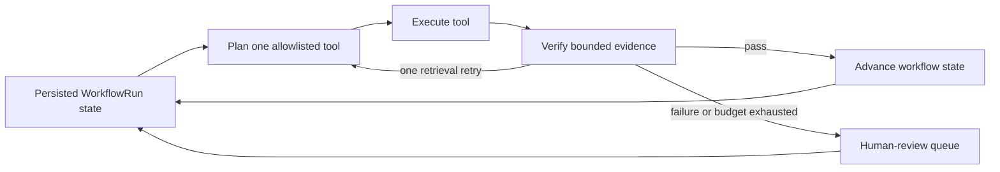

# Architecture

`careai-platform` is a local-first enterprise demo for MLOps and LLMOps workflows using synthetic healthcare-like data only.

## Local Runtime

- PostgreSQL stores platform metadata, lineage records, registry metadata, and audit events.
- Redis supports online feature/cache demos.
- MLflow provides local experiment tracking.
- Azurite provides optional blob-storage-like local development.
- FastAPI services expose the control plane, model inference, and RAG workflows.
- The web console provides a small TypeScript UI for interview demos.

## Service Boundaries

- `apps/control-plane-api`: orchestration, metadata, registry, promotion, monitoring, audit, governance workflows, tenant-aware workflow runs, review queue items, and Payment Integrity cases. It tracks dataset assets, model artifacts, deployments, prompt templates, evaluation runs, approvals, audit events, prediction events, model error events, drift snapshots, agent workflow state, human review handoffs, and synthetic payer case records through a FastAPI/SQLAlchemy service with Alembic migrations for persistent databases.
- `apps/inference-service`: synthetic claims-risk inference with configurable local or MLflow model loading, champion/challenger traffic-split simulation, Pydantic feature validation, feature freshness checks, safe prediction audit and monitoring events, SLO-oriented error events, `prediction.created` publication, deterministic fallback scoring when no model is available, and optional workflow-signal emission into the control-plane runtime.
- `apps/rag-service`: document ingestion, retrieval, prompt registry, safety checks, RAG-facing endpoints, a verifier-driven answer retry loop, `rag.query_answered` publication, and optional workflow-signal emission for policy reasoning steps without raw question or answer text.
- `libs/common-python`: shared settings, JSON logging, correlation IDs, audit schemas, event schemas/publishers, observability helpers, and common errors.

## Agent Workflow Runtime

The control-plane workflow runtime uses bounded loop engineering rather than an unbounded agent. Each iteration persists a planner decision, executes one allowlisted tool, verifies bounded evidence, and records whether it advanced, retried, or required human review. `planner_state_json.loop_history` retains the latest plan, verifier, retry, and handoff events for audit and restart-safe inspection. The verifier requires a valid risk score/band after scoring, policy evidence after retrieval, and a final decision before closure. Policy retrieval may retry once when evidence is incomplete; any other verifier failure becomes a human-review handoff.

The control plane now includes a lightweight workflow runtime intended for payer-style agent orchestration. A `WorkflowRun` represents a bounded agent plan such as `payment_integrity_claim_review` or `prompt_self_optimization`. Each run records `tenant_id`, target business object, current step, status, structured inputs/outputs, reviewer assignment, whether human review is required, and planner metadata for autonomous execution.

Services advance runs by sending workflow signals. Example signals are `claims_risk_scored`, `policy_answered`, `human_review_completed`, and `case_closed`. The runtime now also supports an autonomous planner that selects the next tool for a workflow, executes bounded steps, and reschedules due runs through a background job. This is intentionally simpler than a full DAG engine, but it demonstrates how reusable AI services can coordinate over a governed runtime instead of embedding workflow logic independently in each service.

Human review is modeled with `ReviewQueueItem` records. When the workflow runtime sees high claims risk, missing grounding, or policy-driven escalation, it creates a queue item and moves the workflow into `waiting_for_review`. Review resolution feeds back into the workflow and closes the loop with auditability.

Prompt optimization is modeled as a governed planner workflow rather than a hidden mutation. The planner can analyze improvement signals, generate a candidate prompt version, create an evaluation record, and either stop for governance review or auto-deploy only when explicit self-approval flags were set at workflow creation time.

Tenant-aware execution is part of the runtime contract. Requests can carry `x-tenant-id` or explicit tenant fields, and workflow, queue, and case records retain that tenant scope so customer-environment demos can show clean operational isolation.

## Payment Integrity Demo Flow

The concrete payer use case is a synthetic Payment Integrity case. A `PaymentIntegrityCase` captures synthetic claim, member, and provider identifiers, linked workflow state, automation findings, supporting source ids, queue status, and final decision.

The intended demo path is:

1. intake a synthetic claim case
2. launch `payment_integrity_claim_review`
3. score claim risk in `inference-service`
4. retrieve policy context in `rag-service`
5. escalate to human review when policy or risk thresholds require it
6. resolve the case with an auditable final decision

This aligns the platform more directly to payer operations by showing how models, retrieval, human review, and deployment safety fit into one governed workflow rather than remaining isolated technical capabilities.

## MLOps Pipeline

- `pipelines/train-claims-risk`: generates deterministic synthetic claims-risk data, trains a scikit-learn model, logs parameters/metrics/model artifacts to MLflow, writes control-plane-compatible metadata, and optionally registers the candidate model with `control-plane-api`.
- `pipelines/ingest-rag`: loads synthetic healthcare-operations Markdown documents, chunks text, generates embeddings through a provider abstraction, and writes either Azure AI Search chunks or a local JSON vector index fallback.
- `pipelines/evaluate-rag`: runs a synthetic RAG evaluation set against `rag-service`, writes a JSON quality/safety report, and optionally registers aggregate metrics as a control-plane `EvaluationRun`.

## LLMOps Ingestion

Synthetic policy and playbook documents live under `data/synthetic_docs`. Ingestion preserves document metadata (`doc_id`, `title`, `version`, `sensitivity_class`, `source_uri`, `allowed_roles`) on every chunk. Local demos use deterministic hash embeddings and a JSON vector index under `data/local/`. Azure demos use Azure OpenAI embeddings and Azure AI Search with a vector field plus searchable text for hybrid retrieval.

Role-based retrieval is modeled as document-level filtering before prompt construction. Azure queries use `allowed_roles/any(...)` filters; the local fallback applies the same filter in process before scoring.

`apps/rag-service` is the LLM gateway. It retrieves authorized chunks, selects an approved prompt from `control-plane-api` when available, otherwise uses a local default prompt, and routes generation to Azure OpenAI chat when configured or a deterministic local mock provider for tests and offline demos. The service now wraps generation in a lightweight agent loop: retrieve, generate, verify citations and groundedness, optionally retry once with verifier feedback, then return the final answer. Responses include citations, prompt version, provider metadata, retrieval metadata, agent-loop metadata, groundedness score, safety flags, and the active correlation ID.

Safety controls reject prompt-injection and secret-exfiltration attempts before retrieval. Medical diagnosis or treatment requests are answered only as policy-context responses and flagged for human review. Audit events sent to the control plane include prompt id/version, retrieved source ids, model/provider metadata, role, and safety flags; raw question and answer text are intentionally excluded.

RAG evaluation is the pre-promotion LLMOps gate. The evaluator measures retrieval hit rate, citation coverage, keyword relevance, groundedness, safety flag rate, disallowed-claim rate, latency, and provider token counts when available. Failed thresholds block promotion until the prompt, retrieval index, safety policy, or model configuration is reviewed. The evaluation report now also emits deterministic improvement recommendations so offline evals can feed the same hill-climbing story as production traces.

## Governance

Responsible AI controls are first-class control-plane records. Model cards capture intended use, prohibited use, synthetic training data summary, metrics, fairness review, explainability, ownership, reviewer, and approval status. Prompt cards capture intended use, data sources, safety constraints, known failure modes, evaluation summary, owner, and approval status. Markdown templates live under `docs/templates/` for interview review and can be copied into structured API records.

Production gates are enforced at the API boundary. A model cannot move to `production` until it has an approved model card and an approved governance `Approval` record. The RAG gateway asks the control plane for `production_ready_only` prompts, so control-plane prompts are not selected unless the prompt is approved and has an approved prompt card. Local fallback prompts remain available for offline demos and tests.

## Monitoring

The control plane stores prediction events for synthetic aggregate claims-risk features, scores, risk bands, latency, model version, and correlation IDs. Drift checks compare baseline training feature distributions from model lineage or a request body against recent serving distributions. Numeric utilization features are binned before PSI calculations so training and serving distributions remain stable and interpretable. The demo uses PSI-style metrics with deterministic `green`, `yellow`, and `red` statuses.

Training-serving skew is represented by feature-level distribution differences. A `red` drift snapshot recommends rollback or human review. Latency monitoring tracks average and p95 latency; business monitoring tracks prediction score and high-risk rate. Error-rate monitoring is backed by structured model error events and SLO thresholds in the summary contract. The `careai-drift-check` CLI provides a scheduled drift-check hook for cron, GitHub Actions, or Azure Container Apps Jobs.

## Deployment Safety

Deployment records model safe production rollout with `champion_model_id`, optional `challenger_model_id`, `traffic_split_json`, `rollback_model_id`, and `health_status`. The control plane exposes canary, set-traffic, and rollback actions. Canary and traffic updates require percentages that sum to 100; rollback clears challenger traffic and restores all traffic to the rollback model. Reads can mark `health_status=rollback_recommended` when champion telemetry breaches latency/error SLOs or latest drift is red.

The inference service simulates traffic split routing locally with deterministic request-ID hashing. It reports `selected_model_role`, selected model version, and traffic split in responses, audit metadata, monitoring events, and event envelopes. This demonstrates mature rollout behavior without needing multiple real model artifacts in the local demo.

## Event Backbone

The platform includes a Kafka/Event Hubs-style event backbone abstraction in `libs/common-python`. Event envelopes carry `event_id`, `event_type`, `schema_version`, `source`, `subject`, `correlation_id`, `created_at`, and a schema-versioned payload. Supported event contracts are:

- `prediction.created`
- `audit.created`
- `model.drift_detected`
- `model.promotion_requested`
- `rag.query_answered`
- `feedback.received`

Local development uses `LocalLoggingEventPublisher`, which logs safe event metadata and can append envelopes to `EVENT_STREAM_LOCAL_PATH` as JSONL. This JSONL file acts like a compact local topic for tests and interview demos. Azure deployments use `AzureEventHubsPublisher` when `AZURE_EVENTHUB_NAME` is set with either `AZURE_EVENTHUB_FULLY_QUALIFIED_NAMESPACE` for managed identity or `AZURE_EVENTHUB_CONNECTION_STRING` for secret-backed demos.

The mapping to Kafka/pub-sub is intentionally direct:

- Event Hubs namespace or Kafka cluster: shared streaming backbone.
- Event hub or Kafka topic: `careai-events`.
- Event type: routing key for consumers and dashboards.
- Correlation ID: distributed trace and audit join key.
- Schema version: compatibility boundary for producers and consumers.
- Consumer group: each projection job, monitor, or retraining trigger reads independently.

`careai-event-consumer` is the local projection job. It reads the JSONL stream once and materializes operational views into PostgreSQL or SQLite: `prediction.created` becomes `PredictionEvent`, `model.drift_detected` becomes `DriftSnapshot`, and governance/RAG/feedback events become safe `AuditEvent` rows. Low-quality `rag.query_answered` traces now also create lightweight online `EvaluationRun` records and improvement-candidate audit events, which makes the event backbone part of a real hill-climbing loop instead of a passive log sink. In Azure, the same pattern would run as an Azure Container Apps Job or Function subscribed to Event Hubs consumer groups. Downstream extensions can add retraining triggers, drift-alert notifications, human-feedback aggregation, or feature-store refreshes without coupling producers to those workflows.

## Cloud Target

The default Azure path is implemented in `infra/terraform`: Docker images are pushed to Azure Container Registry and deployed to Azure Container Apps with a shared user-assigned managed identity. Supporting Azure services include Azure AI Search, Key Vault, Storage Account, Event Hubs, Log Analytics, and Application Insights. PostgreSQL, Redis, and Azure ML are Terraform-controlled optional resources so demo environments can avoid unnecessary cost. AKS and Helm remain optional extensions.
