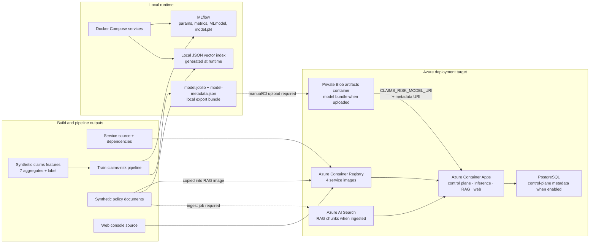
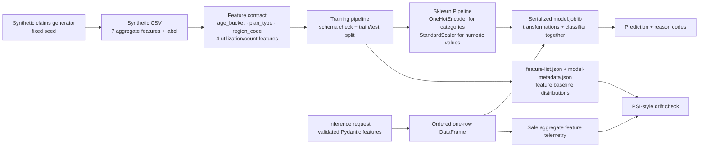
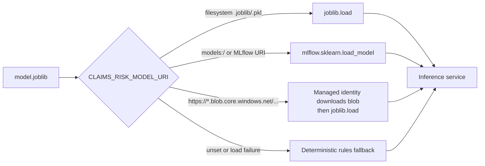

# Artifact Deployment Wiring

This guide answers two separate questions that are easy to blur together:

1. **Which artifacts are packaged or deployed to each runtime component?**
2. **Which artifacts are only registered, configured, or expected to be supplied later?**

The control plane records artifact metadata and deployment decisions. It does not itself copy model files into a serving container or publish them to Azure Blob Storage.

Workflow state is a separate deployment concern: `WorkflowRun` records, bounded verifier history, and human-review queue items are persisted by the control plane in PostgreSQL. They are not model artifacts and do not travel with the inference image.

## Visual Map

Solid arrows are implemented by the repository. Dashed arrows are supported deployment seams that still require an explicit upload, ingestion, or configuration step.

## Artifact-to-Component Inventory

| Artifact | Local location / creation | Azure destination | Consumer | Wiring and current status |
| --- | --- | --- | --- | --- |
| Service container images | Built from each service `Dockerfile` | Azure Container Registry | Four Container Apps | Implemented. GitHub Actions builds, pushes, and updates control plane, inference, RAG, and web-console images. |
| Trained claims-risk `model.joblib` | Training pipeline writes it to its output directory; the current demo bundle is under `data/local/demo/azure-model-artifacts/` | Private Storage Account `artifacts` container | Inference service | **Supported but not automated.** The model is intentionally not copied into the inference image. Upload it to Blob Storage, then set `CLAIMS_RISK_MODEL_URI`. |
| Claims-risk `model-metadata.json` | Produced next to the exported joblib | Same Blob path / version prefix as the model | Inference service and control plane | **Supported but not automated.** Set `CLAIMS_RISK_MODEL_METADATA_PATH` to the companion Blob URI. |
| MLflow run and native model | Local `mlruns/` or local MLflow container | Optional Azure ML workspace only | Training, experiment review, optional inference URI loading | MLflow logging is implemented. Azure ML is optional and no default train-to-Azure-ML promotion path is wired. |
| Model registry metadata, cards, approvals, deployments | Control-plane database | Azure PostgreSQL when enabled; otherwise container-local SQLite | Control plane | Implemented as metadata/governance state, not as a binary model distribution mechanism. |
| Synthetic policy documents | `data/synthetic_docs/` | Baked into RAG image for fallback; Azure AI Search for cloud retrieval | RAG service | RAG Docker image copies source documents. Azure Search ingestion is supported by the ingest pipeline but must be run with Search and embedding settings. |
| Local RAG vector index | `data/local/rag-index.json`, generated on demand | None | RAG service | Local fallback only. It is not baked into the RAG image; the service builds it from the copied documents when absent. |
| Azure AI Search chunks and vectors | `ingest-rag` pipeline output | `careai-rag-chunks` Azure AI Search index | RAG service | **Supported but not automated by Terraform or deployment workflow.** Requires Search API key and an Azure OpenAI embedding configuration. |
| Workflow state and verification history | PostgreSQL `WorkflowRun` plus review-queue records | Durable Azure PostgreSQL | Control-plane API and optional scheduler | **Requires durable DB and scheduling.** Terraform can provision PostgreSQL, but no Container Apps Job or queue scheduler is created by default. |
| Web console static bundle | Vite `dist/` generated while building the image | Web-console image in ACR | Nginx web console Container App | Implemented. API URLs are build-time values, so the web image must be rebuilt when target URLs change. |

## Component View

| Component | Receives at build time | Reads at runtime | Does not receive automatically |
| --- | --- | --- | --- |
| Control plane API | Application code and Python dependencies | PostgreSQL/SQLite metadata, audit events, model/prompt/deployment records | Model binary, MLflow artifact files, RAG index |
| Inference service | Application code and Python dependencies | `CLAIMS_RISK_MODEL_URI`, optional metadata URI, control-plane URL, event and observability settings | Any trained model unless a path/URI is supplied |
| RAG service | Application code, ingestion package, `data/synthetic_docs/` | Local index generated from documents, or Azure AI Search + Azure OpenAI configuration | Precomputed local index and Azure Search documents/chunks |
| Web console | Static Vite bundle with API URLs | Browser calls to control plane and RAG endpoints | MLflow, models, document indexes, database credentials |

## Feature Building and Serving Contract

The claims-risk example has feature engineering, but it is **pipeline-embedded**, not a separate deployed feature platform. The synthetic generator produces model-ready aggregate values; the training pipeline owns the learned transformations and serializes them inside the model artifact.

### The current feature set

| Category | Features | Building / validation behavior |
| --- | --- | --- |
| Categorical | `age_bucket`, `plan_type`, `region_code` | Generator selects fixed synthetic categories; the trained pipeline one-hot encodes them; inference restricts age bucket and plan type and validates a region-code pattern. |
| Numeric aggregates | `prior_claim_count`, `recent_visit_count`, `medication_count`, `chronic_condition_count` | Generator deterministically creates bounded synthetic utilization/count measures; the trained pipeline standardizes them; inference rejects negative and out-of-range values. |
| Label | `high_risk_claim_next_30d` | Generated only for training and evaluation; never sent to the inference service. |
| Freshness | `feature_timestamp` | Optional serving metadata, not a training feature. The service emits a missing/stale/future warning when appropriate. |

### What is deployed where

| Item | Stored/deployed location | Used by |
| --- | --- | --- |
| Raw synthetic training CSV | Local `data/` output; an Azure Storage dataset path is only a metadata convention today | Training pipeline only |
| Feature contract constants | Training package and inference service source code | Training schema check and inference request validation |
| Encoder, scaler, and classifier | Combined inside `model.joblib` / the MLflow model artifact | Inference service after it loads the model |
| `feature-list.json` and baseline feature distribution | Training output, MLflow metadata, and model metadata | Lineage review and drift checks |
| Recent aggregate feature values | Control-plane prediction-event records | Monitoring and drift computation |

### Important boundaries

- There is **no feature store**, stream processor, raw-claims extractor, or online/offline feature materialization service in this demo.
- The inference caller supplies already-aggregated feature values. That keeps the demo deterministic and avoids transmitting raw claim-level data.
- `CLAIMS_RISK_FEATURE_VERSION` labels the serving contract, but the service does not currently compare that value against the feature-list artifact at load time.
- The feature contract is currently defined in both training and inference packages. It is identical today, but a shared versioned schema package would be the next production hardening step.

## Model Serving Paths

For Blob loading, the Container Apps user-assigned managed identity has `Storage Blob Data Contributor` in Terraform. Terraform exposes the model and metadata URIs only when their variables are non-empty; the deployment workflow can also inject them from GitHub repository variables.

## What Is Actually Deployed Today

The local Docker stack can run all components without a trained model or cloud retrieval configuration:

- The inference service reports `fallback_mode: true` until a model URI/path is supplied.
- The RAG service uses its local JSON vector index until both Azure AI Search and Azure OpenAI embedding settings are complete.
- The web console remains usable while APIs start because it has synthetic fallback data.

The Azure foundation creates the Blob container, AI Search service, Container Apps, managed identity, and optional PostgreSQL/Redis/Event Hubs/Azure ML resources. It does **not** upload a model to Blob Storage or ingest documents into AI Search as part of `terraform apply` or the current deployment workflow.

## Deployment Checklist

For a real-model Azure demo, complete these explicit steps after training:

1. Upload a versioned `model.joblib` and matching `model-metadata.json` to the private `artifacts` Blob container.
2. Set `CLAIMS_RISK_MODEL_URI` and `CLAIMS_RISK_MODEL_METADATA_PATH` in Terraform variables or GitHub repository variables.
3. Deploy or restart inference, then verify `GET /models/active` reports `model_loaded: true` and `fallback_mode: false`.
4. Run RAG ingestion with Azure AI Search and Azure OpenAI embedding configuration, then verify `GET /readyz` reports `azure-ai-search` retrieval.
5. Enable PostgreSQL or supply `DATABASE_URL` before treating control-plane records as durable Azure state.

## Source of Truth

- Training export and MLflow logging: `pipelines/train-claims-risk/src/train_claims_risk/train.py`
- Model load and Blob identity flow: `apps/inference-service/src/careai_inference_service/model_manager.py`
- RAG document copy and local fallback: `apps/rag-service/Dockerfile` and `apps/rag-service/src/careai_rag_service/retrieval.py`
- Azure artifact container and identity RBAC: `infra/terraform/main.tf`
- Container App environment wiring: `infra/terraform/container_apps.tf`
- Build/deploy-time environment wiring: `.github/workflows/deploy-azure-container-apps.yml`
