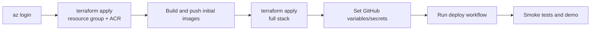

# Azure Deployment Runbook

This runbook describes the default Azure Container Apps deployment path for `careai-platform`.

## Deployment Sequence

The first deployment has a bootstrap loop because Container Apps need images in ACR, and the Vite web console needs API URLs at image build time.



## 1. Bootstrap Azure Resources

```bash
cd infra/terraform
terraform init
terraform fmt -check
terraform validate
terraform apply \
  -target=azurerm_resource_group.this \
  -target=azurerm_container_registry.this
```

## 2. Push Initial Images

```bash
ACR_LOGIN_SERVER="$(terraform output -raw acr_login_server)"
az acr login --name "${ACR_LOGIN_SERVER%%.azurecr.io}"

docker build --platform linux/amd64 -f ../../apps/control-plane-api/Dockerfile -t "$ACR_LOGIN_SERVER/control-plane-api:latest" ../..
docker build --platform linux/amd64 -f ../../apps/inference-service/Dockerfile -t "$ACR_LOGIN_SERVER/inference-service:latest" ../..
docker build --platform linux/amd64 -f ../../apps/rag-service/Dockerfile -t "$ACR_LOGIN_SERVER/rag-service:latest" ../..
docker build \
  --platform linux/amd64 \
  -f ../../apps/web-console/Dockerfile \
  --build-arg VITE_CONTROL_PLANE_API_URL=http://localhost:8000 \
  --build-arg VITE_RAG_SERVICE_URL=http://localhost:8002 \
  -t "$ACR_LOGIN_SERVER/web-console:latest" \
  ../../apps/web-console

docker push "$ACR_LOGIN_SERVER/control-plane-api:latest"
docker push "$ACR_LOGIN_SERVER/inference-service:latest"
docker push "$ACR_LOGIN_SERVER/rag-service:latest"
docker push "$ACR_LOGIN_SERVER/web-console:latest"
```

The first web image can point at localhost because it will be rebuilt by the GitHub deployment workflow after Container App URLs exist.

The explicit `linux/amd64` platform is important when bootstrapping from Apple Silicon macOS. Terraform only references image tags in ACR; it does not control image CPU architecture. Without an explicit platform, a local Mac build can push an ARM-only image that is not suitable for the default Azure Container Apps runtime.

## 3. Apply Full Terraform

```bash
terraform plan -out tfplan
terraform apply tfplan
```

Capture outputs:

```bash
terraform output -raw resource_group_name
terraform output -raw acr_login_server
terraform output -json container_apps_names
terraform output -json container_apps_urls
terraform output -raw azure_ai_search_endpoint
terraform output -raw event_hub_name
terraform output -raw event_hubs_fully_qualified_namespace
```

## 4. Configure GitHub Deployment

Create repository variables:

| Variable | Source |
| --- | --- |
| `AZURE_CLIENT_ID` | Entra federated credential client ID. |
| `AZURE_TENANT_ID` | Azure tenant ID. |
| `AZURE_SUBSCRIPTION_ID` | Azure subscription ID. |
| `AZURE_RESOURCE_GROUP` | Terraform `resource_group_name`. |
| `ACR_LOGIN_SERVER` | Terraform `acr_login_server`. |
| `CONTROL_PLANE_APP_NAME` | Terraform `container_apps_names.control_plane_api`. |
| `INFERENCE_APP_NAME` | Terraform `container_apps_names.inference_service`. |
| `RAG_APP_NAME` | Terraform `container_apps_names.rag_service`. |
| `WEB_CONSOLE_APP_NAME` | Terraform `container_apps_names.web_console`. |
| `CONTROL_PLANE_URL` | Optional; workflow can resolve from app name. |
| `INFERENCE_URL` | Optional; workflow can resolve from app name. |
| `RAG_URL` | Optional; workflow can resolve from app name. |
| `WEB_CONSOLE_URL` | Optional; workflow can resolve from app name and uses it for API CORS. |
| `AZURE_AI_SEARCH_ENDPOINT` | Terraform `azure_ai_search_endpoint`. |
| `AZURE_AI_SEARCH_INDEX` | Usually `careai-rag-chunks`. |
| `AZURE_OPENAI_ENDPOINT` | Optional Azure OpenAI endpoint. |
| `AZURE_OPENAI_CHAT_DEPLOYMENT` | Optional chat deployment. |
| `AZURE_OPENAI_EMBEDDING_DEPLOYMENT` | Optional embedding deployment. |
| `AZURE_EVENTHUB_NAME` | Terraform `event_hub_name`. |
| `AZURE_EVENTHUB_FULLY_QUALIFIED_NAMESPACE` | Terraform `event_hubs_fully_qualified_namespace`. |

Create repository secrets only when the integration is enabled:

| Secret | Purpose |
| --- | --- |
| `DATABASE_URL` | Durable PostgreSQL connection string. |
| `REDIS_URL` | Optional Redis connection string. |
| `AZURE_AI_SEARCH_API_KEY` | Required by the current Search client for Azure-backed retrieval. |
| `AZURE_OPENAI_API_KEY` | Required for Azure OpenAI provider mode. |
| `AZURE_EVENTHUB_CONNECTION_STRING` | Optional fallback if not using managed identity. |
| `APPLICATIONINSIGHTS_CONNECTION_STRING` | Optional telemetry export. |

Run `.github/workflows/deploy-azure-container-apps.yml` from GitHub Actions. The workflow builds images, pushes them to ACR, updates Container Apps, injects secrets/references, resolves API URLs for the web build, and runs smoke tests.

## 5. Smoke Test

```bash
CONTROL_PLANE_URL=https://<control-plane-app> \
INFERENCE_URL=https://<inference-app> \
RAG_URL=https://<rag-app> \
WEB_CONSOLE_URL=https://<web-console-app> \
scripts/demo_azure_smoke_test.sh
```

## Known Deployment Choices

- `enable_postgres = false` keeps cost lower but makes control-plane state ephemeral unless a `DATABASE_URL` secret is supplied.
- Terraform provisions Azure AI Search, but Azure-backed RAG requires Search API key plus Azure OpenAI embedding configuration until managed identity Search data-plane auth is implemented.
- Event Hubs namespace/name are passed to Terraform-created apps when enabled. A connection string can be supplied as a workflow secret for environments that are not using managed identity.
- The web console is static. Rebuild it whenever API base URLs change.

## Production Hardening

- Use private endpoints and private DNS for data services.
- Move Terraform state to a protected remote backend.
- Enable durable PostgreSQL and run migrations as a release step.
- Add scheduled drift jobs and alert rules.
- Replace API-key Search access with managed identity.
- Split public UI ingress from internal service ingress.
