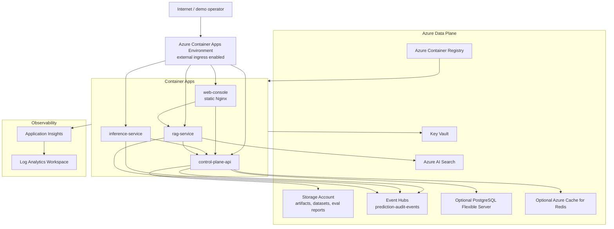

# Azure Network Architecture

The current Terraform target favors a low-friction interview demo on Azure Container Apps. It uses managed identities and RBAC where practical, keeps secrets out of source control, and documents where production networking should become stricter.

## Current Demo Posture

- Container Apps ingress is external for simple browser and curl demos.
- A user-assigned managed identity pulls from ACR and receives scoped RBAC for Storage, Key Vault, Azure AI Search, and Event Hubs.
- Azure AI Search is provisioned by Terraform, but the current application wrapper still uses Search API-key auth for data-plane queries. Set `AZURE_AI_SEARCH_API_KEY` when enabling Azure-backed RAG.
- PostgreSQL and Redis are optional because they can add cost. Without PostgreSQL or a supplied `DATABASE_URL`, Azure container-local control-plane state is ephemeral.
- The web console is a static Vite build; API URLs are baked into the Docker image at build time.

## Production Network Recommendations

For a production version, tighten the topology:

- Put Container Apps in an internal environment behind Application Gateway or Front Door with WAF.
- Use private endpoints for PostgreSQL, Storage, Key Vault, Azure AI Search, Redis, and Event Hubs where supported.
- Disable public network access on data services after private endpoints and DNS are configured.
- Move Terraform state to an Azure Storage backend with encryption, state locking, and strict RBAC.
- Replace Search API-key auth with managed identity data-plane auth in the application client.
- Use managed identities or Entra authentication for PostgreSQL where operationally feasible.
- Split public web ingress from internal API ingress if the UI is the only public entry point.
- Add Azure Monitor alert rules for health, latency, fallback rate, drift status, ingestion failures, and RAG safety flags.
