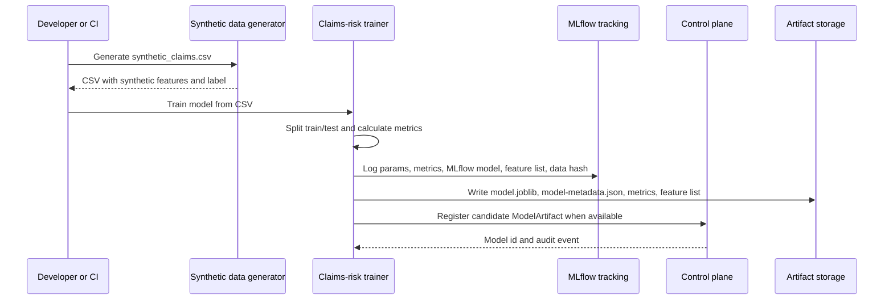
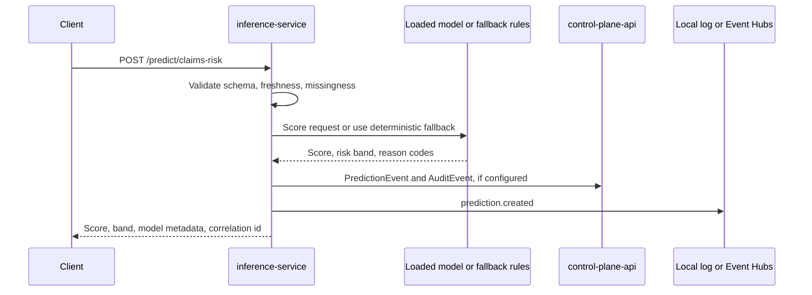
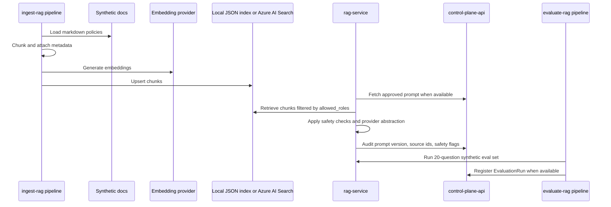

# Data Flow

This document summarizes the main runtime and batch flows. All examples use synthetic data and synthetic policy documents only.

## MLOps Training And Registration



The training command does not automatically publish the serialized model bundle to Azure Blob Storage. For Azure inference, upload a versioned `model.joblib` plus matching `model-metadata.json` to the private artifacts container, then configure `CLAIMS_RISK_MODEL_URI` and `CLAIMS_RISK_MODEL_METADATA_PATH`. See [artifact deployment wiring](../artifact_deployment_wiring.md).

## Real-Time Inference And Monitoring



Monitoring reads persisted prediction events from the control plane. Drift checks compare baseline distributions against recent prediction features and return `green`, `yellow`, or `red` status with deterministic PSI-style metrics.

## LLMOps Ingestion, Retrieval, And Evaluation



Terraform provisions Azure AI Search but does not run the ingestion pipeline. Run the ingestion job with the Search and Azure OpenAI embedding configuration before enabling Azure-backed retrieval.

## Bounded Workflow Orchestration

```mermaid
sequenceDiagram
    participant Case as Payment Integrity Case
    participant CP as Control Plane / WorkflowRun
    participant Score as Inference Service
    participant RAG as RAG Service
    participant Review as Human Review Queue

    Case->>CP: Create tenant-scoped WorkflowRun
    CP->>CP: Plan one allowlisted tool and persist plan event
    CP->>Score: Claims-risk scoring
    Score-->>CP: Score and risk band
    CP->>CP: Verify score/band evidence
    CP->>RAG: Policy retrieval when needed
    RAG-->>CP: Policy source ids and summary
    CP->>CP: Verify policy evidence
    alt evidence incomplete, first occurrence
        CP->>CP: Persist retry event and retry retrieval once
    else verification failure or review required
        CP->>Review: Create review item; mark waiting_for_review
    else verified
        CP->>CP: Resolve case and persist final decision
    end
```

The planner is deterministic rather than an LLM or LangGraph graph. It persists the latest 40 plan, verification, retry, and handoff events in `WorkflowRun.planner_state_json.loop_history`, avoiding raw request values in the history.

## Data Classification

| Data | Classification | Storage | Notes |
| --- | --- | --- | --- |
| Synthetic claims CSV | Synthetic, no PHI | Local `data/` or Azure Storage datasets container | Used for model training and testing. |
| Synthetic model artifacts | Synthetic demo model | MLflow artifact store or Azure Storage artifacts container | May be promoted through control-plane metadata. |
| Synthetic policy documents | Synthetic operational content | Repository `data/synthetic_docs/` | Indexed locally or in Azure AI Search. |
| Prediction events | No raw PHI/PII-like values | PostgreSQL and optional Event Hubs | Contains synthetic feature values, score, band, latency, and correlation id. |
| Audit events | Metadata only | PostgreSQL and optional Event Hubs | Avoids raw sensitive payloads; stores target ids, actor, action, and metadata. |

## Correlation And Audit

Every service accepts or creates an `x-correlation-id`. That id is included in responses, structured logs, audit events, prediction events, and published event envelopes so a demo incident can be traced from UI/API request to model/RAG behavior and governance records.
