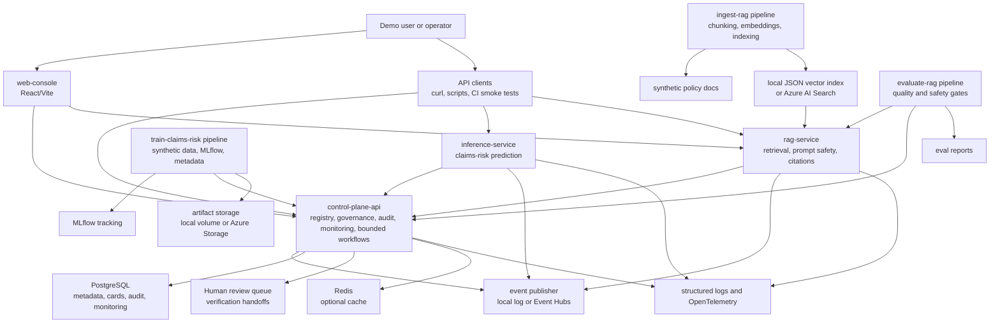

# System Architecture

`careai-platform` is a local-first, Azure-deployable demonstration of enterprise MLOps and LLMOps controls for synthetic healthcare-style workflows. It is intentionally built around separable services so an interview walkthrough can discuss ownership boundaries, operational controls, and cloud deployment tradeoffs.

## Service Responsibilities

| Component | Responsibility | Local default | Azure target |
| --- | --- | --- | --- |
| `control-plane-api` | Tracks datasets, models, prompts, deployments, approvals, cards, prediction/drift/audit events, `WorkflowRun` state, bounded verifier history, and human-review queue items. | FastAPI plus PostgreSQL from Compose; the scheduler is launched separately. | Azure Container Apps plus durable PostgreSQL; add a Container Apps Job or queue-backed scheduler for due workflows. |
| `inference-service` | Serves synthetic claims-risk predictions with validation, fallback scoring, audit, monitoring events, and traffic-split simulation. | FastAPI plus deterministic fallback unless a model URI/path is configured. | Azure Container Apps with artifact/model configuration from environment or registry metadata. |
| `rag-service` | Runs role-filtered retrieval, prompt selection, safety checks, local/Azure LLM provider abstraction, citations, and audit events. | Local JSON vector index and mock chat provider. | Azure AI Search plus Azure OpenAI when endpoint, key, and deployment variables are configured. |
| `web-console` | Interview demo UI for lifecycle, monitoring, RAG, governance, and audit views. | Vite dev server or Nginx static bundle. | Azure Container Apps static Nginx image with API URLs baked at build time. |
| Pipelines | Generate synthetic data/docs, train models, ingest docs, and evaluate RAG quality. | CLI modules and local files. | Same CLIs run in CI, jobs, or containers with Azure storage/search configuration. |

## Governance Controls

- Synthetic data only; no real PHI, credentials, or customer branding.
- Mutating control-plane, inference, and RAG paths produce audit events.
- Production model promotion is blocked until the model has an approved model card and approval.
- Production prompt usage is blocked unless the prompt has an approved prompt card.
- Monitoring supports prediction-event persistence, simple drift checks, latency summaries, and rollback recommendation metadata.
- Event publisher abstractions allow local logging now and Event Hubs-backed pub/sub later.
- Workflow orchestration is deterministic and bounded: plan one allowlisted tool, execute, verify evidence, retry policy retrieval once, then hand off failures to a reviewer. It does not currently depend on LangGraph or an LLM planner.
