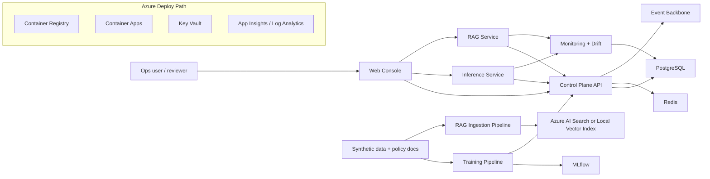
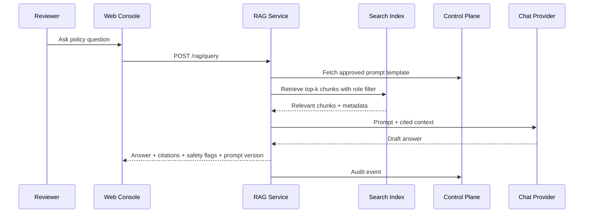
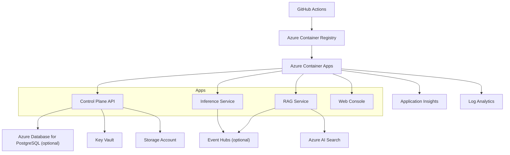

```mermaid
flowchart LR
    GD["Generate synthetic claims data"] --> TT["Train/test split"]
    TT --> TM["Train sklearn model"]
    TM --> MT["Compute metrics + segment metrics"]
    MT --> ML["Log to MLflow"]
    ML --> REG["Register candidate model in control plane"]
    REG --> APR["Approval + model card"]
    APR --> DEP["Deploy champion / challenger"]
    DEP --> PRED["Serve predictions"]
    PRED --> DR["Drift, latency, error monitoring"]
    DR --> RB["Rollback recommendation"]
```

# CareAI Platform Interview Deck

Audience: Senior Manager AI/ML Engineering system design interview
Format: slide-by-slide deck script with speaker notes
Scope: enterprise MLOps + LLMOps + Azure deployment for synthetic healthcare-style workflows

---

## Slide 1 - CareAI Platform

### On-slide

- Enterprise AI platform for healthcare operations
- Synthetic-data-only demo of MLOps, LLMOps, governance, and Azure deployment
- Designed for safe rollout, observability, and repeatable platform reuse

### Speaker Notes

This is CareAI Platform, a production-style demo that shows how I would design an AI platform for payer and healthcare-operations use cases without using any real PHI. The point of the system is not just one model or one chatbot. It is a reusable platform that manages data, models, prompts, deployments, governance, monitoring, and rollback across both traditional ML and GenAI workflows.

The interview framing I would use is: this platform helps operations teams move from isolated AI experiments to governed, deployable, observable AI services.

---

## Slide 2 - Problem and Product Framing

### On-slide

- Customers:
  - payment integrity teams
  - claims operations
  - prior authorization operations
  - member support operations
  - internal AI platform teams
- Product jobs:
  - register and govern assets
  - deploy reusable inference and RAG services
  - monitor quality, drift, latency, and safety
  - support approvals and auditability

### Speaker Notes

If I summarize the product in one sentence: CareAI is an internal AI platform for healthcare operations teams that need secure, governed, reusable AI services across predictive models and document-reasoning workflows.

The direct users are platform engineers, ML engineers, data scientists, and operations stakeholders who need to review outcomes and approvals. The business-facing customers are teams like payment integrity and support operations that want faster decisions, consistent workflows, and better operational visibility.

---

## Slide 3 - High-Level Architecture

### On-slide

### Speaker Notes

This is the 30-second system view. The control plane is the center of gravity. It tracks datasets, model artifacts, prompt templates, approvals, deployments, audit events, evaluation runs, and bounded workflow state. On the execution side, I have two serving planes: a prediction API for claims-risk inference and a RAG gateway for policy and operations Q and A. Pipelines feed both sides, and monitoring closes the loop after deployment.

I would call out that the design is local-first for development, but Azure-native for deployment.

---

## Slide 4 - Control Plane and Governance

### On-slide

- Core assets:
  - datasets
  - models
  - deployments
  - prompt templates
  - evaluation runs
  - approvals
  - audit events
  - model cards and prompt cards
- Governance gates:
  - no production model without approval and model card
  - no production prompt without approval and prompt card
- Correlation IDs and audit trails on mutating actions

### Speaker Notes

I would position the control plane as the governance and workflow brain of the platform. It stores metadata, lineage, evaluation status, approval decisions, and rollout state. This is where platform maturity shows up, because the platform is not just serving predictions. It knows what is deployed, why it was approved, and what changed.

The key interview point is that promotion to production is policy-controlled, not an ad hoc API call. That maps well to regulated enterprise environments.

---

## Slide 5 - MLOps Lifecycle

### On-slide

### Speaker Notes

The traditional ML flow starts with synthetic claims-like data, trains a risk model, logs runs to MLflow, then writes metadata to the control plane. That gives me both experiment tracking and enterprise metadata. After that, approvals and model cards gate deployment.

For the interview, I would emphasize the promotion path: dev, candidate, staging, approved, production, deprecated. That makes the lifecycle concrete.

---

## Slide 6 - Real-Time Inference and Safe Rollout

### On-slide

- Inference service:
  - validates request schema
  - loads active model
  - falls back to deterministic rules if model unavailable
  - emits prediction events and audit events
- Safe deployment patterns:
  - champion / challenger
  - canary traffic split
  - rollback metadata
  - rollback recommendation placeholder based on latency, error, drift

### Speaker Notes

This is where I show production maturity. The inference service does not blindly assume the model is present and healthy. It has schema validation, freshness and missingness checks, explicit model metadata in responses, and a deterministic fallback mode if the artifact is unavailable.

For rollout safety, I support champion and challenger routing with traffic split simulation. In a real environment, the same control pattern can front a proper traffic router or service mesh.

---

## Slide 7 - LLMOps and RAG Flow

### On-slide

### Speaker Notes

The RAG side shows a different lifecycle but the same platform discipline. Documents are chunked, embedded, and indexed either into Azure AI Search or a local fallback index. At query time, the service enforces role-based retrieval filters, selects an approved prompt template if available, runs safety checks, and requires citations in the response.

That last part matters for healthcare operations. Even in a demo, I want the system to show groundedness and traceability instead of a free-form answer engine.

---

## Slide 8 - Loop Engineering Framing

### On-slide

- Retrieval loop:
  - retrieve
  - answer
  - evaluate groundedness
  - flag safety issues
- Decision loop:
  - request approval
  - gate promotion
  - deploy
  - monitor
  - rollback or retrain
- Monitoring loop:
  - prediction events
  - drift checks
  - evaluation runs
  - audit trail
- Cross-service workflow loop:
  - plan one allowlisted tool
  - execute and verify evidence
  - retry incomplete policy retrieval once
  - hand off other failures to human review

### Speaker Notes

If asked whether this follows loop engineering, my answer is yes. The platform is built around repeated operational loops instead of a one-shot model invocation pattern.

The RAG system has a retrieval and validation loop. The MLOps side has a deployment and monitoring loop. The governance layer has an approval loop. The control plane also has a cross-service case loop: it deterministically plans one allowlisted tool, executes it, verifies the evidence, retries incomplete policy retrieval once, and creates a human-review item for other failures. `WorkflowRun.planner_state_json.loop_history` preserves those events for inspection. This is custom bounded orchestration today, not LangGraph or an unbounded LLM agent; the next cloud step is a durable queue or Container Apps Job scheduler.

---

## Slide 9 - Monitoring, Drift, and Observability

### On-slide

- Monitoring tracks:
  - prediction counts
  - latency
  - error rate
  - feature missingness
  - drift status
  - RAG evaluation metrics
  - safety flag counts
- OpenTelemetry instrumentation
- Application Insights when configured
- Prediction and audit events can publish to Event Hubs

### Speaker Notes

This is where I show that the platform is meant to run in production, not just pass a notebook demo. Prediction events are persisted for monitoring. Drift checks compare recent serving distributions to training baselines. Logs and traces are correlated across services with a request ID. Event Hubs support is there so this can evolve toward a more event-driven architecture without changing the service contracts.

In the interview I would explicitly say what is simplified versus production-grade. For example, drift detection is deterministic and lightweight now, but the operational seams are correct.

---

## Slide 10 - Azure Deployment Architecture

### On-slide

### Speaker Notes

The default cloud path is Azure Container Apps plus ACR, with Terraform managing the resource group, environment, storage, search, observability, and optional services like Postgres, Redis, Event Hubs, and Azure ML. I like this path for the interview because it shows cloud maturity without forcing Kubernetes complexity unless the conversation goes there.

I would also mention managed identity and secret externalization through Key Vault references.

---

## Slide 11 - Tradeoffs, Risks, and What Is Mocked

### On-slide

- Intentionally mocked or simplified:
  - synthetic data only
  - local fallback embeddings and chat provider
  - lightweight drift logic
  - simplified reason codes and business rules
  - no real clinical workflow integration
- Why that is still interview-strong:
  - architecture is realistic
  - control points are production-aligned
  - Azure path is concrete

### Speaker Notes

I want to be direct about what is mocked. The point is not to pretend the demo is a live healthcare production platform. The point is to demonstrate system design judgment: governance boundaries, deployment patterns, lifecycle management, and operational feedback loops.

That honesty actually helps in the interview because it shows I know where the edges are.

---

## Slide 12 - Close: Why This Design Fits the Role

### On-slide

- Reusable AI platform, not one-off models
- Strong governance and deployment discipline
- Supports payer-focused operational workflows
- Ready for forward deployment and continuous improvement

### Speaker Notes

My closing line would be: this design fits a payer-focused AI platform role because it brings together reusable services, healthcare-aware governance, deployment automation, and production observability. It is built to support complex operational workflows, not just isolated demos.

If the panel wants to go deeper, I can branch into any of four areas: control plane and governance, MLOps rollout safety, RAG and loop engineering, or Azure deployment and operations.

---

## Appendix - Suggested 10-Minute Talk Track

### Minute 0-1

Introduce the product and the customer problem.

### Minute 1-2

Show the high-level architecture and identify the control plane as the system center.

### Minute 2-4

Walk through the MLOps lifecycle: train, register, approve, deploy, monitor, rollback.

### Minute 4-6

Walk through the RAG flow: ingest docs, retrieve with role filters, answer with citations, log audit events.

### Minute 6-8

Explain governance, approvals, model cards, prompt cards, and responsible AI gates.

### Minute 8-9

Explain observability, drift monitoring, and event-driven extensibility.

### Minute 9-10

Land the Azure deployment story and close with tradeoffs and next production steps.
