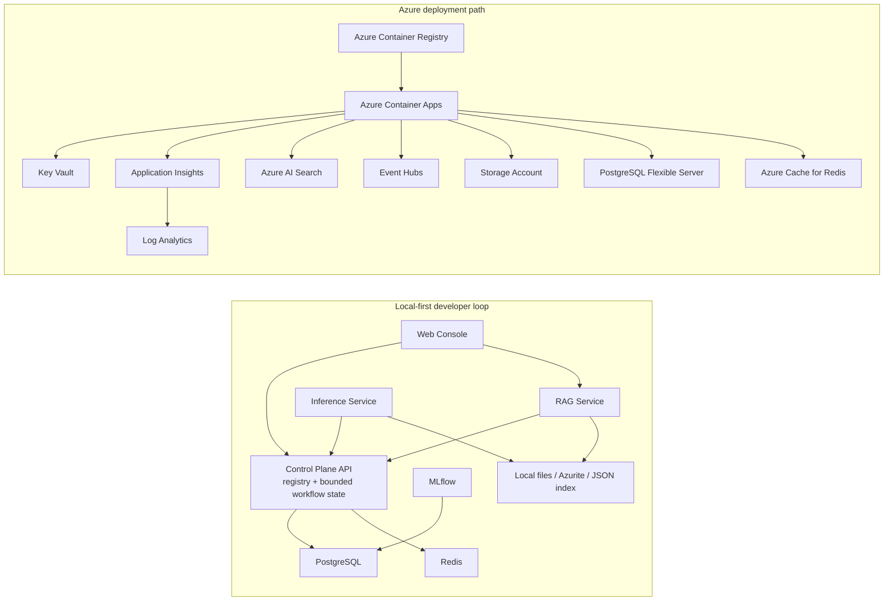

# Local vs Azure Stack

This page is a compact interview aid for `careai-platform`.

## Local Stack

| Layer | Stack |
| --- | --- |
| Language | Python 3.11+ |
| Backend services | FastAPI, Pydantic, SQLAlchemy/SQLModel |
| ML workflow | scikit-learn, MLflow |
| Data stores | PostgreSQL, Redis |
| File/object storage | Azurite or local JSON/file fallbacks |
| RAG ingestion | Local deterministic embeddings, JSON vector index fallback |
| Frontend | TypeScript, React/Vite |
| Runtime | Docker Compose |
| Workflow orchestration | Deterministic bounded planner started by the local CLI; PostgreSQL persists workflow state and verifier history. |
| Quality gates | pytest, ruff, structured JSON logging |

## Azure Stack

| Layer | Stack |
| --- | --- |
| Compute | Azure Container Apps |
| Container registry | Azure Container Registry |
| Infrastructure as code | Terraform |
| Metadata store | Azure Database for PostgreSQL Flexible Server, optional |
| Cache | Azure Cache for Redis, optional |
| Storage | Azure Storage Account |
| Search | Azure AI Search |
| Event backbone | Azure Event Hubs |
| Secrets | Azure Key Vault |
| Observability | Log Analytics, Application Insights, OpenTelemetry |
| Optional MLOps platform | Azure Machine Learning |
| AI providers | Azure OpenAI for chat and embeddings when configured |
| Delivery | GitHub Actions with OIDC or documented secret fallback |
| Workflow orchestration | Control-plane Container App plus durable PostgreSQL; add a Container Apps Job, Function, or queue worker for scheduled due-workflow execution. |

## One-Slide Architecture

## 60-Second Talk Track

`careai-platform` is a local-first enterprise demo that shows how a healthcare-style platform can support both MLOps and LLMOps without using real PHI.

Locally, we run FastAPI services, PostgreSQL, Redis, MLflow, and a React/Vite console through Docker Compose. The training pipeline generates synthetic claims-risk data, trains a scikit-learn model, logs it to MLflow, and registers metadata in the control plane. The RAG pipeline ingests synthetic policy docs, chunks them, embeds them, and serves them through a retrieval layer with safety checks and citations.

On Azure, the same services are containerized and deployed to Azure Container Apps from Azure Container Registry. Terraform provisions the platform dependencies: Key Vault, Storage, Azure AI Search, Event Hubs, Log Analytics, Application Insights, and optional PostgreSQL or Redis. OpenTelemetry and structured logs feed observability, while Event Hubs provides the streaming backbone for prediction, audit, drift, and feedback events.

The workflow runtime follows the same pattern: locally, a deterministic scheduler advances one allowlisted tool at a time and persists verification history. In Azure, the API wiring is ready, but scheduling still needs an explicit Container Apps Job, Function, or queue worker.

The interview message is simple: the local stack proves the workflow quickly, and the Azure stack shows how the same design becomes a governed enterprise platform.
