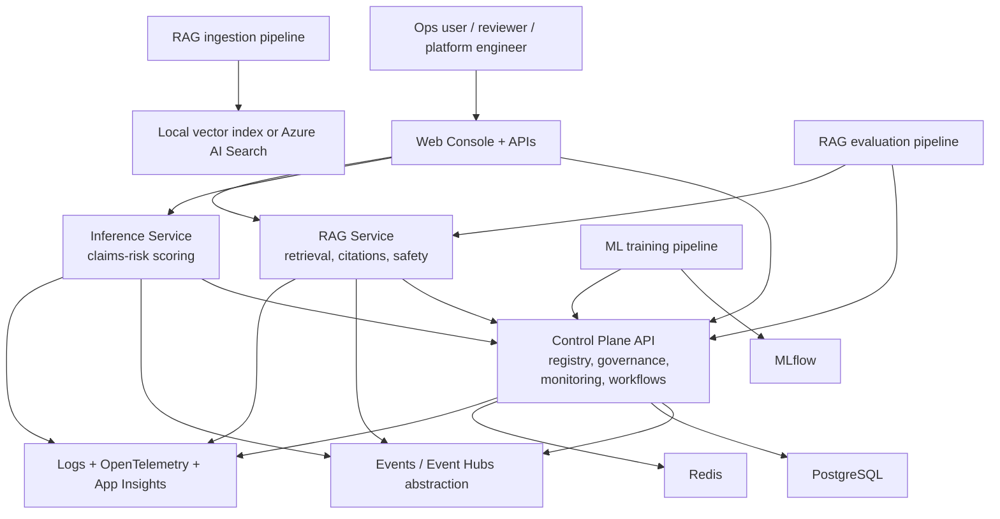
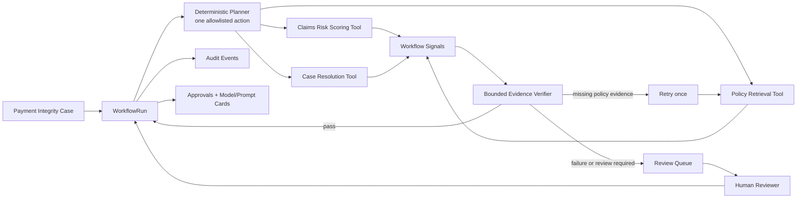
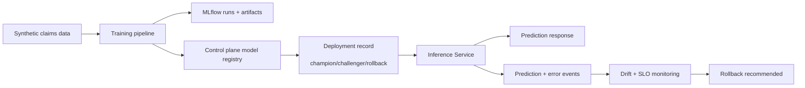
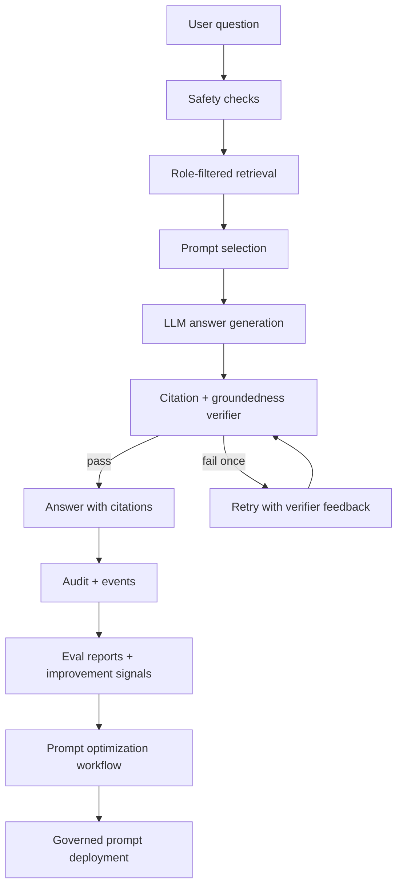
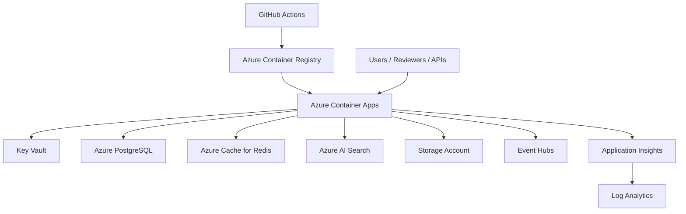

# System Design Interview Guide

This guide is a rehearsal artifact for explaining `careai-platform` in a system design interview. It is structured as:

1. one high-level session you can deliver in 3-5 minutes
2. three deep-dive sessions you can use depending on where the interviewer pulls
3. short talk tracks for tradeoffs, failure modes, and scaling

Everything in this project uses synthetic healthcare-style data only.

## How To Use This Guide

Start with the high-level session. Do not open with every component. Open with the problem, the product boundary, and the control loops.

Then choose 2-3 deep dives based on the interviewer:

- platform/governance heavy: use Deep Dive 1 and Deep Dive 4
- ML platform heavy: use Deep Dive 2
- GenAI/agent heavy: use Deep Dive 3
- cloud/platform/SRE heavy: use Deep Dive 4

## Session 1: High-Level Architecture

### Goal

Explain what the product does, who it serves, and why the architecture is organized this way.

### Talk Track

`careai-platform` is a payer-style AI platform for synthetic healthcare operations workflows. The core idea is to support both classical ML and GenAI on one governed platform path instead of building separate islands for training, inference, RAG, evaluation, governance, monitoring, and deployment.

I would describe it as four layers:

- experience layer: web console, APIs, scripts
- execution layer: inference, RAG, bounded workflows, deterministic planner
- control layer: registry, governance, approvals, audit, deployment metadata, monitoring
- platform layer: PostgreSQL, Redis, MLflow, event backbone, Azure infrastructure

What makes it interview-strong is that it is not just serving models. It closes the loop with:

- approval gates
- audit trails
- drift and error monitoring
- human review
- rollback safety
- prompt and model lifecycle controls

### Diagram

### What To Emphasize

- one control plane for both ML and LLMOps
- local-first for demo speed, Azure-ready for enterprise deployment
- workflow orchestration is governed, not hidden inside services
- human review is a first-class platform concept

## Deep Dive 1: Control Plane, Governance, and Workflow Runtime

### Goal

Show how the platform governs releases and orchestrates work across services.

### Talk Track

The control plane is the operational brain of the system. It stores datasets, model artifacts, prompt templates, deployments, evaluations, approvals, cards, audit events, prediction events, drift snapshots, and workflow runs.

The key design decision is that orchestration lives here, not inside each serving service. That gives us:

- consistent auditability
- shared lifecycle controls
- reusable approval gates
- clean tenant scoping

For payer-style workflows, a `WorkflowRun` coordinates scoring, policy retrieval, human review, and final resolution. The planner is deterministic, not LangGraph or an LLM tool-selector: it picks one allowlisted action, executes it, verifies evidence, persists the result, and pauses when governance or human review is needed. Policy retrieval gets one bounded retry for incomplete evidence; other verifier failures become a review handoff.

### Diagram

### Why This Matters

- services stay narrower and easier to own
- audit and approval logic stays centralized
- autonomous execution is bounded and reviewable
- governance can block production changes without changing app code

### Tradeoffs

- simpler than Temporal, LangGraph, or a full DAG engine
- good for platform demonstration and bounded workflows
- LLM planning is deliberately excluded until structured outputs, tool policy, evaluation, and approval gates are mature
- would evolve to a stronger workflow engine for high-scale production

## Deep Dive 2: MLOps Lifecycle, Inference, Monitoring, and Safe Rollout

### Goal

Show how a traditional ML workload moves from synthetic training to production-safe inference.

### Talk Track

The ML path starts with synthetic claims-style data generation and training through MLflow. The pipeline logs metrics, artifacts, lineage, feature lists, and training hashes. The trained artifact is then registered in the control plane as a model artifact with stage metadata.

From there, deployment is not just “ship the model.” The system tracks:

- champion and challenger model ids
- traffic split
- rollback model id
- deployment health

At serving time, inference validates features, checks freshness and missingness, returns reason codes, emits monitoring events, and can fall back to deterministic rules if model load fails.

### Diagram

### What To Highlight

- inference and monitoring are tightly connected
- rollout safety is part of the platform contract
- monitoring supports release decisions, not just dashboards
- fallback behavior preserves service availability

### Good Interview Language

“Serving is only one step in the model lifecycle. The platform value is the release safety loop around it.”

## Deep Dive 3: LLMOps, RAG, and Loop Engineering

### Goal

Show how RAG is governed like a production system rather than a demo chatbot.

### Talk Track

The RAG path ingests synthetic policy documents, chunks them, adds metadata such as allowed roles and sensitivity class, and indexes them into either a local vector index or Azure AI Search.

At query time, the RAG service:

1. applies safety checks before retrieval
2. retrieves role-authorized context
3. selects an approved prompt when available
4. generates an answer
5. verifies citations and groundedness
6. retries once with verifier feedback if needed
7. emits audit and event metadata without raw sensitive text

That is the beginning of loop engineering. Then the outer loop kicks in:

- eval reports
- improvement recommendations
- prompt optimization workflows
- optional governed self-deployment

### Diagram

### What To Highlight

- citations are part of the contract
- prompt use is gated by prompt cards and approval
- improvement loop is explicit, not hand-wavy
- prompt mutation is governed, auditable, and bounded

### Good Interview Language

“The inner loop is retrieval, answer, verify, retry. The outer loop is evaluation, improvement recommendation, and governed deployment.”

## Deep Dive 4: Azure Deployment, Network Boundaries, and Operations

### Goal

Show how the local design maps to a production-grade Azure footprint.

### Talk Track

The Azure deployment path uses Container Apps as the default compute layer. That keeps the demo aligned to modern platform patterns without taking on AKS complexity by default.

The key Azure resources are:

- Azure Container Registry for images
- Azure Container Apps for services
- PostgreSQL for metadata
- Redis for cache
- Azure AI Search for RAG retrieval
- Storage Account for artifacts and reports
- Event Hubs for event-driven patterns
- Log Analytics and Application Insights for observability
- Key Vault for secrets

The main boundary to explain is that app services stay stateless, while the control plane, storage, and event layers hold the system memory.

### Diagram

### Operational Story

- local contracts stay the same in Azure
- services are containerized and environment-driven
- observability is centralized
- Event Hubs supports future stream processing and retraining triggers
- planner job can run as a Container Apps Job on a schedule; Terraform does not create that job yet

## Likely Follow-Up Questions

### How would you scale this?

- split workflow orchestration onto a stronger engine for high concurrency
- move from local deterministic planner actions to queue-backed async execution with idempotency and dead-letter handling
- introduce stronger tenancy isolation
- use consumer groups and separate projections for monitoring, feedback, and retraining

### What are the main risks?

- over-centralizing too much logic in the control plane
- prompt self-modification without strong governance
- weak retrieval quality causing false confidence
- workflow sprawl if every team creates custom planner logic

### What would you productionize next?

1. stronger identity and RBAC
2. real async queue/job execution
3. richer eval harness and replay tests
4. production-grade workflow engine or policy-gated structured LLM planner
5. stricter model/prompt release policies

## Recommended 20-Minute Interview Flow

1. 3-5 min: High-level architecture
2. 5 min: Deep Dive 1 on control plane and governance
3. 5 min: Deep Dive 2 or 3 depending on interviewer bias
4. 3-5 min: Deep Dive 4 on Azure and ops

## One-Sentence Summary

`careai-platform` is a governed AI platform for synthetic payer-style operations that unifies ML, RAG, workflow orchestration, monitoring, and safe deployment on a local-first design that maps cleanly to Azure.
